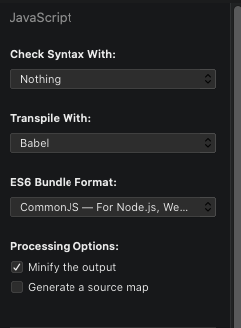

# WTE - WordPress Theme Easy

Easy WordPress theme development.

This project uses the dependencies:
- [Bootstrap](https://getbootstrap.com/docs/4.0)
- [Cash Dom](https://github.com/kenwheeler/cash)
- [Font Awesome](https://www.npmjs.com/package/font-awesome)
- [Owl Carousel](https://www.npmjs.com/package/owl.carousel)

## Requirements

To use this theme you must have installed the latest stable version of [node](https://nodejs.org/en/)

We use node because we like performance, and CDN acquisition, besides importing unnecessary resources,

depends on a stable connection.

## Download

You can clone the project or simply download it using:

```
wget --no-check-certificate --content-disposition https://github.com/MatheusKindrazki/easy-wordpress-theme/archive/v1.0.1.zip
# --no-check-cerftificate was necessary for me to have wget not puke about https
curl -LJO https://github.com/MatheusKindrazki/easy-wordpress-theme/archive/v1.0.1.zip
```

## Configuration

To use the theme, just enter the `THEME` folder and run the command:

```
yarn
```

## Installation

To install any dependency just run the `yarn add` command following the lib you want to add:

```
yarn add bootstrap
```

The theme is divided into two parts.

- `mu-plugins` – used to store plugins that are not for updating.
- `theme` – The location of the clean theme files and `node_modules`.

## Usage

### Build

Both sass and js files must be built. We recommend using tools like Prepros or Codekit.

- `./js/main.js` – Where all required JS files are imported.
- `./js/custom` – User created files.
- `./js/bundle` – Js file compiled.
- `./style/sass/style.scss` – Where all required SASS files are imported.
- `./style/sass/custom` – User created files.
- `./style/css` – CSS file compiled.

### JS Compiler Configuration

If you use the ES6 import structure you need to compile using Babel or another tool of your choice.


